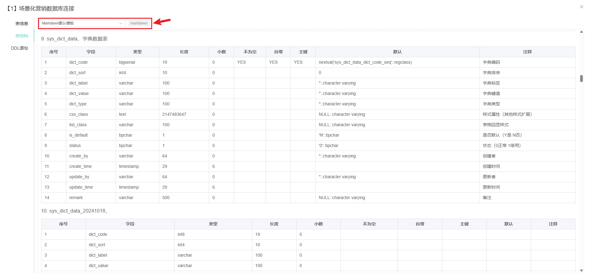

<h1 align="center" style="margin: 30px 0 30px; font-weight: bold;">SchemaX v2.0.0</h1>
<h4 align="center">基于SpringBoot3+Vue3前后端分离的数据库结构转换与迁移工具</h4>
<p align="center">
	<a href="https://gitee.com/wsitm/SchemaX">
      
    </a>
	<a href="https://gitee.com/wsitm/SchemaX/blob/master/LICENSE">
      
    </a>
</p>

### 免安装单机下载win版 [SchemaX-win32-x64-v1.1.0.zip](https://gitee.com/wsitm/SchemaX/releases/tag/v1.1.0)

## 简介
* Schema（数据库结构）X（转换）- 数据库结构转换与迁移工具
* 解决异构数据库迁移时DDL语句兼容性问题，<strong>DDL转换</strong>功能支持主流数据库方言互转
* 支持<strong>动态驱动管理</strong>，通过上传JDBC驱动文件实现对各类数据库的连接支持
* 提供<strong>表结构可视化</strong>功能，在线查看和导出数据库表结构信息
* 内置<strong>模板引擎</strong>，目前支持Excel、Markdown格式的表结构文档生成
* 采用<strong>前后端分离架构</strong>，前端基于Vue3 + Univer实现表格编辑，后端基于SpringBoot3提供RESTful API

### 技术架构
* **后端**: SpringBoot3 + MyBatis + H2数据库 + jdialects + JSqlParser
* **前端**: Vue3 + Element Plus + Univer + CodeMirror
* **构建工具**: Maven + Vite
* **运行环境**: Java 17+

## 核心功能

### 🔄 DDL转换引擎
- **智能DDL解析**: 基于JSqlParser解析各种数据库的DDL语句
- **跨数据库转换**: 支持MySQL、Oracle、PostgreSQL、SQL Server等主流数据库方言互转
- **双向转换**: 支持DDL语句到表结构元信息的相互转换
- **批量处理**: 支持多表结构同时转换

### 🚀 动态驱动管理
- **驱动上传**: 支持自定义上传各类数据库JDBC驱动包
- **动态加载**: 基于ClassLoader实现驱动的热插拔
- **驱动状态监控**: 实时显示驱动加载状态
- **广泛兼容**: 理论上支持所有提供JDBC驱动的关系型数据库

### 🔗 数据库连接管理
- **连接配置**: 支持多种数据库连接参数配置
- **连接测试**: 实时验证数据库连接有效性
- **表过滤**: 支持通配符和正则表达式过滤表名
- **缓存机制**: 智能缓存表结构信息提升访问速度

### 📊 表结构可视化
- **在线查看**: 基于Univer在线渲染表结构信息
- **字段详情**: 展示字段名、类型、长度、约束等完整信息
- **索引信息**: 显示表的索引结构和约束关系
- **DDL预览**: 实时生成并预览各数据库方言的DDL语句

### 📝 模板化文档生成
- **多格式支持**: 支持Excel、Markdown等文档格式
- **模板引擎**: 内置强大的模板渲染引擎
- **自定义模板**: 支持创建个性化文档模板
- **一键导出**: 一键导出符合规范的数据库文档


## 技术架构详解

### 后端核心技术
- **动态驱动加载**: 基于自定义ClassLoader和ShimDriver包装类，实现JDBC驱动的热插拔
- **表结构解析**: 利用 [Hutool](https://gitee.com/dromara/hutool) 的MetaUtil和自定义元信息处理器，适配不同数据库的表结构读取
- **DDL生成引擎**: 集成 [jdialects](https://gitee.com/drinkjava2/jdialects) 方言库，支持40+种数据库方言的DDL语句生成
- **SQL解析器**: 采用 [jsqlparser](https://github.com/JSQLParser/JSqlParser.git) 进行DDL语句的词法和语法分析
- **模板渲染**: 模板引擎支持Markdown和Excel格式的文档生成
- **并发处理**: 基于线程池的异步表结构刷新机制

### 前端技术栈
- **核心框架**: Vue3 Composition API + Pinia状态管理
- **UI组件库**: [Element Plus](https://element-plus.org/zh-CN/#/zh-CN) 提供企业级界面组件
- **表格引擎**: [Univer](https://gitee.com/dream-num/univer) 实现Excel级别的在线表格编辑体验
- **代码编辑**: [CodeMirror](http://github.com/marijnh/CodeMirror.git) 提供专业的SQL和Markdown编辑器
- **构建工具**: Vite提供快速的开发和构建体验

### 数据流设计
```
用户操作 → Vue组件 → REST API → Spring Boot Controller 
    ↓
业务逻辑层 → 服务层 → 数据访问层 → 数据库/H2缓存
    ↓
动态驱动加载 → 数据库连接 → 表结构解析 → DDL生成
    ↓
模板渲染 → 文档生成 → 前端展示
```


## 演示图

<table>
    <tr>
        <td>
            <strong>DDL转换DDL-切换数据库方言</strong>
            <br>
            
        </td>
        <td>
            <strong>DDL转换表结构</strong>
            <br>
            
        </td>
    </tr>
    <tr>
        <td>
            <strong>表结构转换DDL</strong>
            <br>
            
        </td>
    </tr>
    <tr>
      <td>
        <strong>连接配置列表</strong>
        <br>
        
      </td>
      <td>
        <strong>连接配置-导出表结构</strong>
        <br>
        
      </td>
    </tr>
    <tr>
      <td>
        <strong>连接配置-查看详情-基本列表</strong>
        <br>
        
      </td>
      <td>
        <strong>连接配置-查看详情-表结构信息</strong>
        <br>
        
      </td>
    </tr>
    <tr>
      <td>
        <strong>连接配置-查看详情-表结构信息</strong>
        <br>
        
      </td>
      <td>
        <strong>连接配置-查看详情-查看DDL语句</strong>
        <br>
        
      </td>
    </tr>
    <tr>
      <td>
        <strong>驱动列表</strong>
        <br>
        
      </td>
      <td>
        <strong>添加/修改驱动</strong>
        <br>
        
      </td>
    </tr>
</table>
