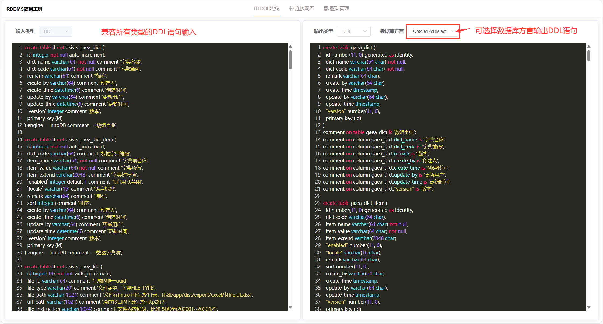
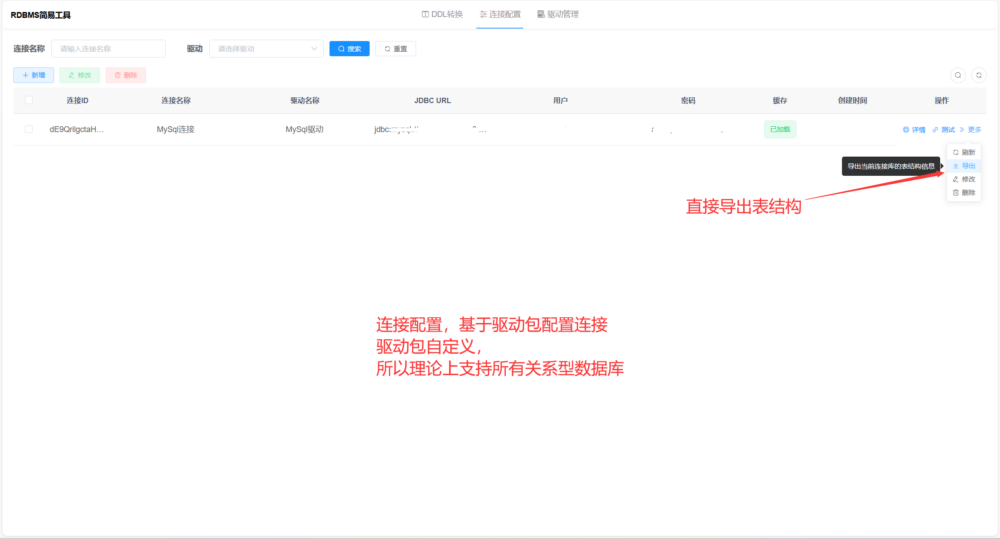
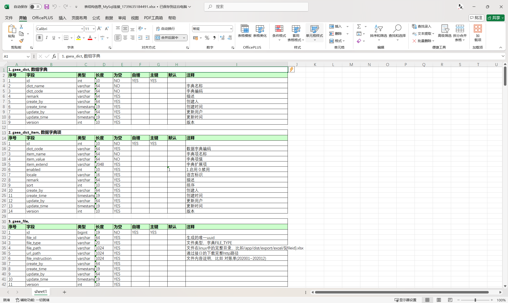
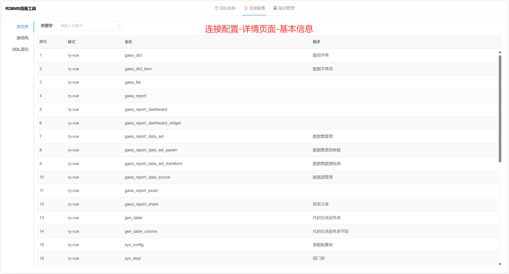
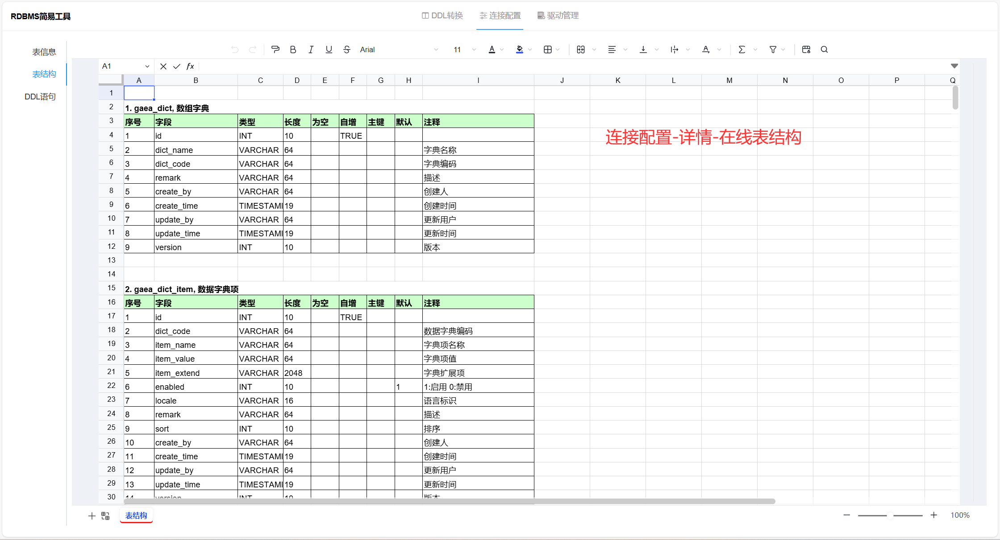
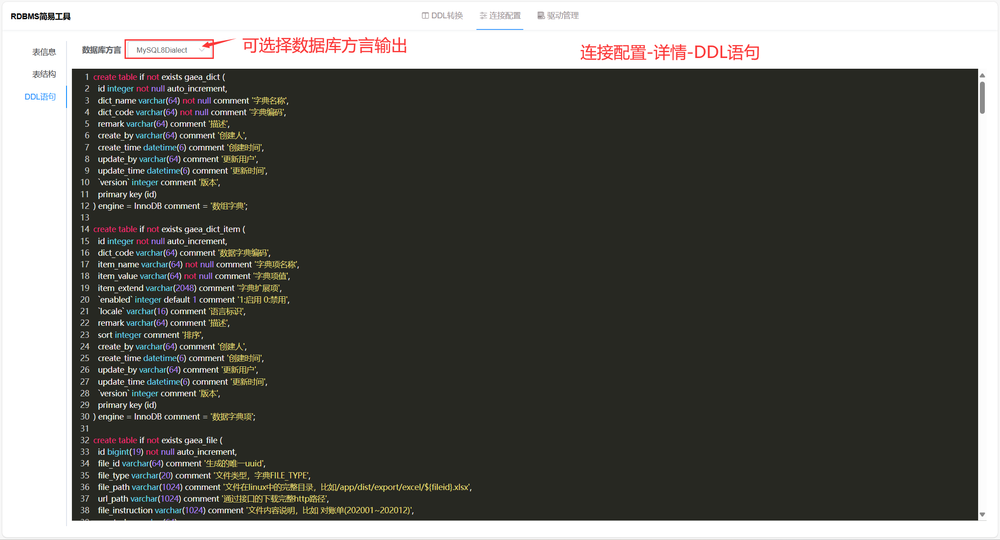
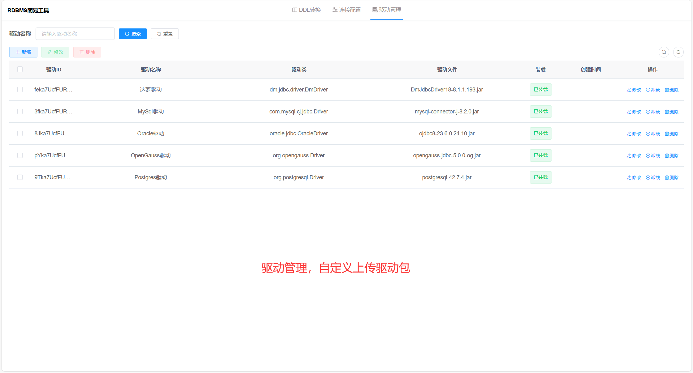
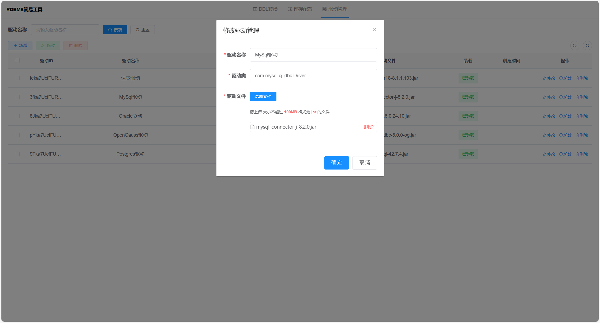

<h1 align="center" style="margin: 30px 0 30px; font-weight: bold;">SchemaX v1.1.0</h1>
<h4 align="center">数据库结构转换</h4>

	
	

## 简介
* Schema（数据库结构）X（转换）
* 迁移数据库库，而异构数据库时就DDL语句让人很头疼。<strong>DDL转换</strong>就可以解决这个问题，理论上可以转换市面上常见的数据库方言的DDL语句。
* 通过上传驱动文件，并<strong>配置对应JDBC驱动包</strong>，然后配置数据库连接，可以直接<strong>导出表结构</strong>、在线<strong>
  查看表结构</strong>、<strong>跨数据库方言生成DDL语句</strong>。
* 驱动包可以自定义上传，所以理论上支持所有关系型数据库。

## 功能介绍

<strong>一、DDL转换</strong>

- DDL转换功能。在不同数据库之间的差异性，兼容输入各种类型的DDL语句。
- 用户只需输入原始的DDL语句，并指定目标数据库的方言，工具即可将其转换为相应的DDL语句。

<strong>二、驱动管理</strong>

- 驱动管理功能，用户能够上传并配置各类数据库驱动包。无论是常见的MySQL、Oracle、PostgreSQL、SQL
  Server，还是更多小众的数据库类型，只需上传相应的驱动包，即可配置。
- 简化了驱动安装与更新的繁琐过程，与各类数据库无缝对接。

<strong>三、连接管理</strong>

- 连接管理工具支持用户配置 JDBC URL，通过简单的设置即可连接到目标数据库。
- 表结构导出：一键导出当前数据库中的所有表结构信息。
- 表信息查看：展示数据库中的所有表基本信息。
- 表结构查看：在线查看当前数据库中的所有表结构信息。
- DDL查看与切换：支持查看所有表的 DDL语句，并且用户可以根据需要轻松切换DDL的数据库方言，在不同数据库之间的迁移和转换提供了极大的便利。

## 演示图

<ul>
  <li>
    <strong>DDL转换DDL-切换数据库方言</strong>
     
    
  </li>
  <li>
    <strong>DDL转换表结构</strong>
     
    
  </li>

  <li>
    <strong>连接配置列表</strong>
     
    
  </li>
  <li>
    <strong>连接配置-导出表结构</strong>
     
    
  </li>
  <li>
    <strong>连接配置-查看详情-基本列表</strong>
     
    
  </li>
  <li>
    <strong>连接配置-查看详情-表结构信息</strong>
     
    
  </li>
  <li>
    <strong>连接配置-查看详情-查看DDL语句</strong>
     
    
  </li>

  <li>
    <strong>驱动列表</strong>
     
    
  </li>
  <li>
    <strong>添加/修改驱动</strong>
     
    
  </li>

</ul>

## 实现原理

- 动态加载 ClassLoader，实现动态装卸 jdbc 驱动
- 基于 [Hutool](https://gitee.com/dromara/hutool)，间接操作jdbc驱动读取表信息
- 基于 [jdialects](https://gitee.com/drinkjava2/jdialects)，根据表结构信息生成DDL语句
- 基于 [jsqlparser](https://github.com/JSQLParser/JSqlParser.git)， 逆向把DDL语句解析表结构信息
- 前端 [Univer](https://gitee.com/dream-num/univer)， 在线渲染 sheet 表，渲染表结构信息
- 前端 [codemirror](http://github.com/marijnh/CodeMirror.git)， 文本编辑器，渲染DDL语句
- 前端 [sqltools](https://github.com/mtxr/vscode-sqltools)， 格式化SQL
- 前端 [xe-utils](https://gitee.com/x-extends/xe-utils)， 函数库、工具类
