<h1 align="center" style="margin: 30px 0 30px; font-weight: bold;">SchemaX v2.1.0</h1>
<h4 align="center">基于SpringBoot3+Vue3前后端分离的数据库结构转换与迁移工具</h4>
<p align="center">
	<a href="https://gitee.com/wsitm/SchemaX">
      
    </a>
	<a href="https://gitee.com/wsitm/SchemaX/blob/master/LICENSE">
      
    </a>
</p>

### 免安装单机下载win版 [SchemaX-win32-x64-v1.1.0.zip](https://gitee.com/wsitm/SchemaX/releases/tag/v1.1.0)

## 简介
* Schema（数据库结构）X（转换）- 数据库结构转换与迁移工具
* 解决异构数据库迁移时DDL语句兼容性问题，<strong>DDL转换</strong>功能支持主流数据库方言互转、转换预检与问题诊断
* 提供<strong>可配置类型映射</strong>，可按源库、目标库、数据类型及长度/精度策略覆盖默认转换行为
* 支持<strong>动态驱动管理</strong>，通过上传JDBC驱动文件实现对各类数据库的连接支持
* 提供<strong>数据库结构快照</strong>，支持查看历史结构并按指定快照生成DDL或导出文档
* 提供<strong>表结构可视化</strong>功能，在线查看和导出数据库表结构信息
* 内置<strong>模板引擎</strong>，支持Excel、Markdown和Word格式的表结构文档生成
* 采用<strong>前后端分离架构</strong>，前端基于Vue3 + Univer Sheets + TinyMCE实现模板编辑，后端基于SpringBoot3提供RESTful API

### 技术架构
* **后端**: SpringBoot3 + MyBatis + H2数据库 + jdialects + JSqlParser + Apache POI
* **前端**: Vue3 + Element Plus + Univer Sheets + TinyMCE + CodeMirror
* **构建工具**: Maven + Vite
* **运行环境**: Java 17+

## 核心功能

### 🔄 DDL转换引擎
- **智能DDL解析**: 基于JSqlParser解析各种数据库的DDL语句
- **跨数据库转换**: 支持MySQL、Oracle、PostgreSQL、SQL Server等主流数据库方言互转
- **双向转换**: 支持DDL语句到表结构元信息的相互转换
- **批量处理**: 支持多表结构、多语句同时转换
- **转换预检**: 转换前检查DDL语法、支持范围和目标方言兼容性
- **问题定位**: 标记问题所属语句、表、字段以及行列位置，并给出原因和修改建议
- **风险诊断**: 检查不支持的数据类型、保留字、默认值函数、分区语法、自增语义和数据库专属表选项
- **结果统计**: 汇总错误、警告、提示及整体成功率，并按表展示转换状态和成功率

### 🧩 类型映射规则
- **规则配置**: 按源数据库、目标数据库、源类型和目标类型配置转换规则
- **参数策略**: 支持保留、固定或忽略长度、精度和小数位
- **优先级控制**: 支持规则优先级、启用状态和内置规则标识
- **快速复用**: 支持新增、编辑、复制和删除映射规则
- **规则测试**: 可输入源字段类型及长度/精度参数，直接验证最终目标类型表达式
- **诊断联动**: DDL预检会展示已命中的映射规则，并提示未覆盖的扩展类型

### 🚀 动态驱动管理
- **驱动上传**: 支持自定义上传各类数据库JDBC驱动包
- **动态加载**: 基于ClassLoader实现驱动的热插拔
- **驱动状态监控**: 实时显示驱动加载状态
- **广泛兼容**: 理论上支持所有提供JDBC驱动的关系型数据库

### 🔗 数据库连接管理
- **连接配置**: 支持多种数据库连接参数配置
- **连接测试**: 实时验证数据库连接有效性
- **表过滤**: 支持通配符和正则表达式过滤表名
- **缓存机制**: 智能缓存表结构信息提升访问速度

### 📸 数据库结构快照
- **连接内管理**: 快照功能融入连接配置，可直接为指定连接新增快照并填写名称和备注
- **自动留档**: 刷新连接元数据缓存时自动保存结构快照
- **历史查看**: 连接详情默认展示实时元数据，也可从右上角切换到任一历史快照
- **DDL查看**: 支持基于当前结构或指定快照生成和查看DDL
- **快照导出**: 导出时可选择指定快照；不选择时使用数据库当前即时结构
- **版本清理**: 支持查看连接下的快照列表并删除不再需要的版本

### 📊 表结构可视化
- **在线查看**: 基于Univer在线渲染表结构信息
- **字段详情**: 展示字段名、类型、长度、约束等完整信息
- **索引信息**: 显示表的索引结构和约束关系
- **DDL预览**: 实时生成并预览各数据库方言的DDL语句

### 📝 模板化文档生成
- **多格式支持**: 支持Excel（`.xlsx`）、Markdown（`.md`）和Word（`.docx`）文档格式
- **模板引擎**: 内置强大的模板渲染引擎
- **变量面板**: 提供表名、表注释、字段列表、字段属性及ID生成等模板变量
- **在线编辑**: Excel模板使用Univer Sheets，Word模板使用TinyMCE，Markdown模板使用CodeMirror
- **模板预览**: 在模板管理和连接详情中预览模板渲染结果
- **自定义模板**: 支持创建、编辑和删除个性化文档模板
- **按版本导出**: 可使用数据库实时结构或指定结构快照渲染并下载文档

#### Word模板能力（TinyMCE）
Word模板使用版本2受控HTML结构保存，由TinyMCE完成在线编辑和预览，后端解析模板变量后通过Apache POI生成`.docx`文件。当前支持：

- `${tableName}`、`${tableComment}`、`${schema}`等变量替换
- `#for(item in columnList)`与`#end`字段循环
- 标题、文本与段落样式、有序/无序列表、分页和简单表格
- A4、A3、Letter纸张，横竖方向、页边距、默认字体和字号设置
- 默认、首页、奇偶页页眉页脚中的文本及变量
- 多张表连续导出，并在表之间自动分页

字段循环示例：

```text
表名：${tableName}
#for(col in columnList)
${col.order}. ${col.name} ${col.typeName} ${col.comment}
#end
```

旧版Univer Docs快照无需手工迁移。打开旧Word模板时，后端会将其规范化为TinyMCE版本2结构；预览和导出仍兼容原始快照。Univer Docs依赖及旧组件继续保留并标记为废弃，当前业务页面不再使用，待其文档能力增强后可重新接入。

> 当前Word模板不支持图片、音视频、脚本、自定义嵌入块以及页眉页脚中的表格；保存和导出时会由后端校验并返回中文提示。
>
> TinyMCE当前以本地GPL模式运行（`license_key: 'gpl'`）。分发或部署时需要遵守GPLv2+；若后续采用不兼容GPL的闭源发布方式，应切换为TinyMCE商业授权。

## 技术架构详解

### 后端核心技术
- **动态驱动加载**: 基于自定义ClassLoader和ShimDriver包装类，实现JDBC驱动的热插拔
- **表结构解析**: 利用 [Hutool](https://gitee.com/dromara/hutool) 的MetaUtil和自定义元信息处理器，适配不同数据库的表结构读取
- **DDL生成引擎**: 集成 [jdialects](https://gitee.com/drinkjava2/jdialects) 方言库，支持40+种数据库方言的DDL语句生成
- **SQL解析器**: 采用 [jsqlparser](https://github.com/JSQLParser/JSqlParser.git) 进行DDL语句的词法和语法分析
- **类型映射引擎**: 使用持久化规则覆盖默认类型转换，支持优先级及长度、精度、小数位策略
- **DDL诊断引擎**: 使用可扩展诊断规则分析语法、类型、保留字和方言语义，并输出问题位置与建议
- **快照管理**: 将连接元数据及字段、索引信息持久化到H2，供历史查看、DDL生成和模板导出复用
- **模板渲染**: 支持Markdown、Excel和Word文档生成；Word模板由Jsoup解析受控HTML，并通过Apache POI导出
- **并发处理**: 基于线程池的异步表结构刷新机制

### 前端技术栈
- **核心框架**: Vue3 Composition API + Pinia状态管理
- **UI组件库**: [Element Plus](https://element-plus.org/zh-CN/#/zh-CN) 提供企业级界面组件
- **电子表格引擎**: [Univer](https://gitee.com/dream-num/univer) 提供Excel模板的在线编辑、预览能力
- **Word模板编辑器**: [TinyMCE](https://www.tiny.cloud/) 提供Word模板的富文本编辑和预览能力
- **代码编辑**: [CodeMirror](http://github.com/marijnh/CodeMirror.git) 提供专业的SQL和Markdown编辑器
- **构建工具**: Vite提供快速的开发和构建体验

### 数据流设计
```
用户操作 → Vue组件 → REST API → Spring Boot Controller 
    ↓
业务逻辑层 → 服务层 → 数据访问层 → 数据库/H2缓存
    ↓
动态驱动加载 → 数据库连接 → 表结构解析 → 实时元数据/结构快照
    ↓
DDL预检诊断 → 类型映射规则 → 方言转换 → DDL生成
    ↓
模板变量上下文 → Excel/Markdown/Word渲染 → 预览或文档下载
```


## 演示图

<table>
    <tr>
        <td>
            <strong>DDL转换DDL-切换数据库方言</strong>
            <br>
            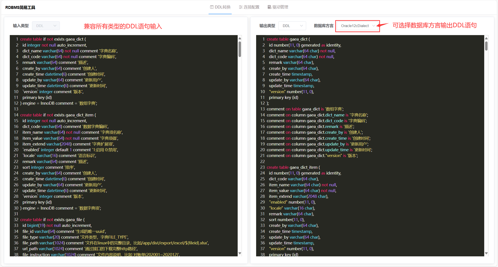
        </td>
        <td>
            <strong>DDL转换表结构</strong>
            <br>
            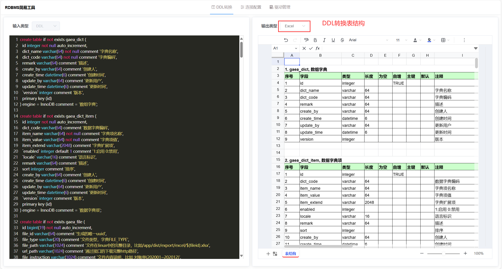
        </td>
    </tr>
    <tr>
        <td>
            <strong>表结构转换DDL</strong>
            <br>
            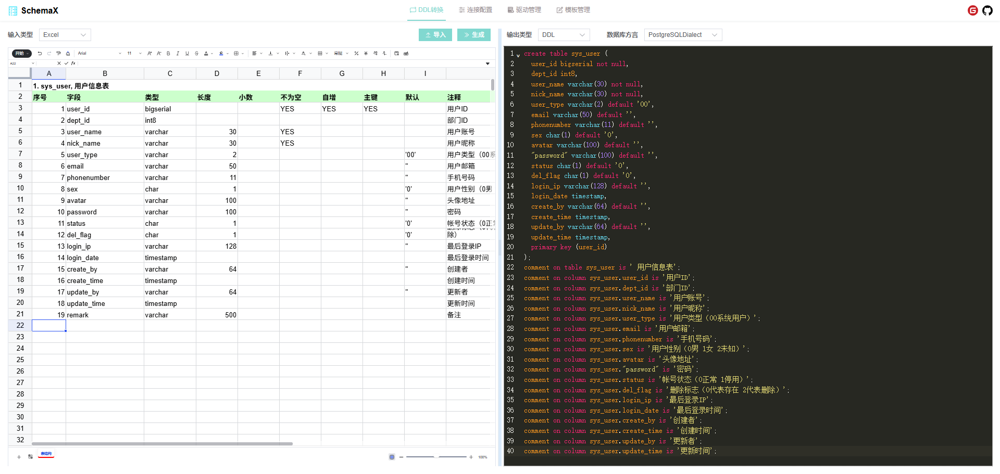
        </td>
    </tr>
    <tr>
      <td>
        <strong>连接配置列表</strong>
        <br>
        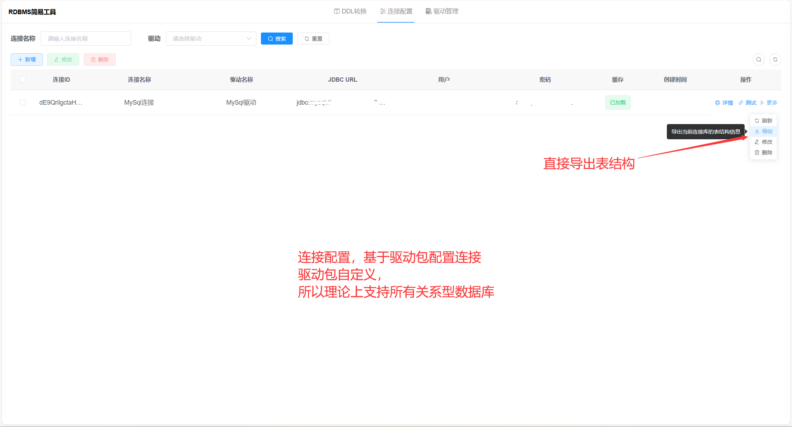
      </td>
      <td>
        <strong>连接配置-导出表结构</strong>
        <br>
        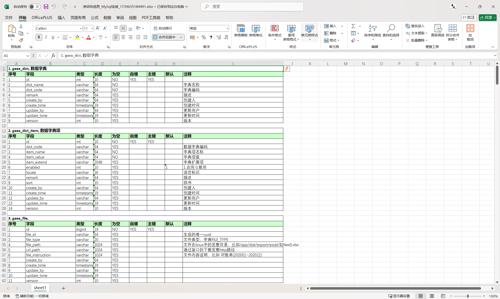
      </td>
    </tr>
    <tr>
      <td>
        <strong>连接配置-查看详情-基本列表</strong>
        <br>
        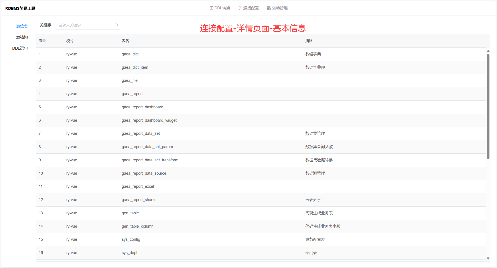
      </td>
      <td>
        <strong>连接配置-查看详情-表结构信息</strong>
        <br>
        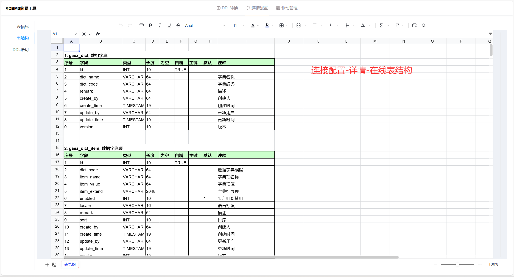
      </td>
    </tr>
    <tr>
      <td>
        <strong>连接配置-查看详情-表结构信息</strong>
        <br>
        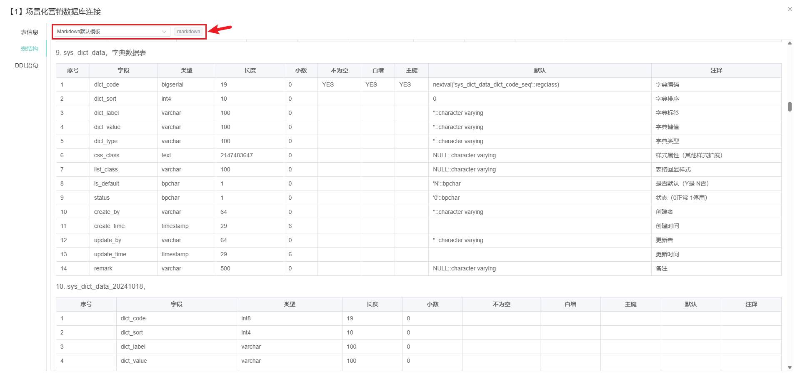
      </td>
      <td>
        <strong>连接配置-查看详情-查看DDL语句</strong>
        <br>
        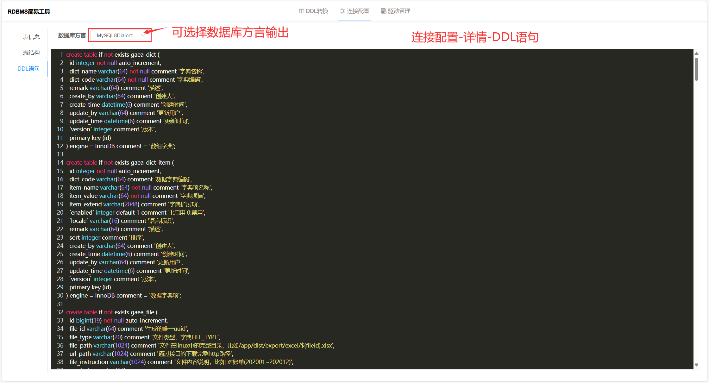
      </td>
    </tr>
    <tr>
      <td>
        <strong>驱动列表</strong>
        <br>
        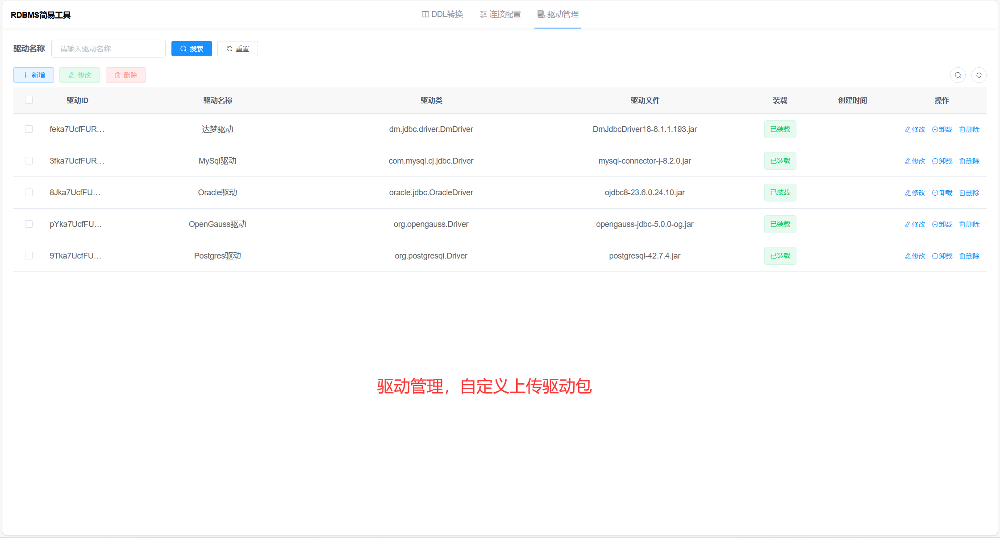
      </td>
      <td>
        <strong>添加/修改驱动</strong>
        <br>
        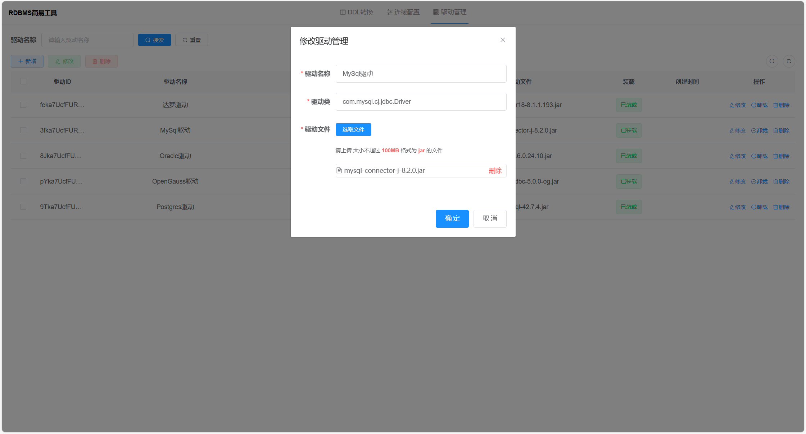
      </td>
    </tr>
</table>
